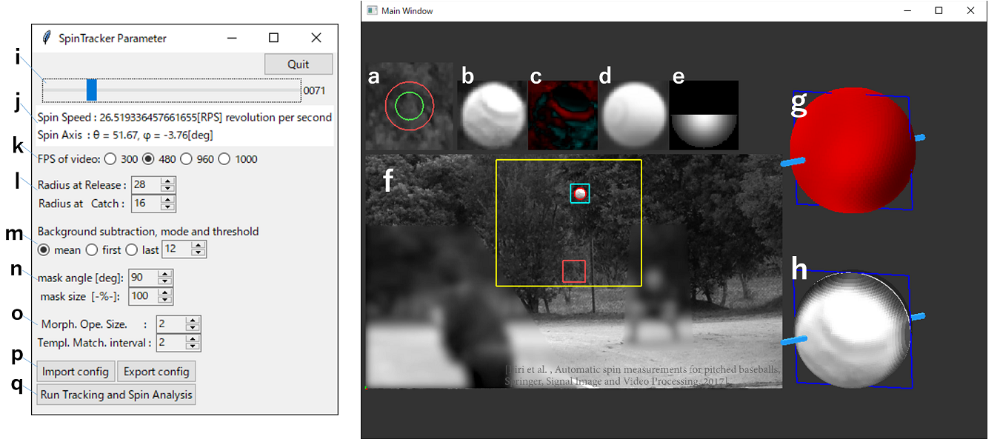

日本語の説明は下にあります．

# SpinTracker_Python
SpinTracker is an application that estimates the spin speed and spin axis of a pitched baseball from a highspeed video. Detailed information This application is a Python implementation of the method described in the following paper.

- Takashi Ijiri, Atsushi Nakamura, Akira Hirabayashi, Wataru Sakai, Takeshi Miyazaki, Ryutaro Himeno, Automatic spin measurements for pitched Baseballs via consumer-grade high-speed cameras, SIViP (2017). doi:10.1007/s11760-017-1075-x.  

This code is for research use only. Contact me (takashi.ijiri80 AT gmail.com) if you would like to use this for commercial use.   

## Required library  
  - pyOpenGL   : install this by "$pip install pyOpenGL"
  - glfw       : install this by "$pip install glfw"
  - OpenCV     : install this by "$pip install opencv-python"
  - matplotlib : install this by "$pip install matplotlib"
  - Pillow     : install this by "$pip install Pillow"
  - scipy      : install this by "$pip install scipy"
Each library can be installed by executing the command "$pip install [library name]" on a command prompt. numpy is also required, but it should be installed automatically during the installation of the above libraries. The application was tested by using the following environment;
Windows 10 / Python 3.8.5 / glfw 2.0.0 / matplotlib 3.3.3 / numpy 1.19.3 / opencv-python 4.4.0.46 / Pillow 8.0.1 / PyOpenGL 3.1.5 / scipy 1.5.4.

## How to start  
Double-click on SpinTracker.bat in the top folder.  
Alternatively, open a command prompt and type "$python src/SpinTracker.py . /sample". 

## How to use

#### 1. Specify a High-Speed Video file (mp4)
- When starting SpinTracker, a video file selection dialog will appear.
- You can seek the video by the scroll bar **(i)** in the dialog or **left/right keys**.
- You can drag the video by **mouse-left-dragging** and zoom by **mouse-middle-dragging**.
- Multiple sample videos are available in "./sample".

#### 2. Specify ROI  (Yellow Rectangle)
- After selecting the video, MainWindow and Parameter Dialog will appear.
- Specify an ROI (region of interest, yellow rectangle) that the ball passes through in the MainWindow by **shift-key + mouse-left-dragging**.
- The smaller ROI, the faster and more accurate the calculation will be.

#### 3. Specify Ball Radius 
- Specify the radius of the ball at release and catch by using the spin control **(l)** in the dialog.
- You can drag the zoom window (pink rectangle) by **space-key + mouse-left-drag** in MainWindow.
- If you align this zoom window with the ball at release (or catch), this rectangle will be magnified in **(b)**. Use this magnified view, to specify the ball radius.

#### 4. Specify the mask
- When shooting video under sunlight, the upper side of the ball may be blown out (overexposed). A mask is used to avoid using this area for calculation. 
- Use the dialog **(n)** to specify the direction and size of the mask.
- The mask will be visualized in **(e)**.

#### 5. Set other parameters
- From the dialog, you can specify the background image generation method and threshold **(m)**, the size of the Morphological Operation after extracting the foreground region **(o)**, and the frame interval for template matching **(o)**. 

#### 6. Save parameters (optional)
- The parameters set above can be saved as a config file and reused when analyzing other videos by using the buttons **(p)**.

#### 7. Estimation of spin speed and axis
- Press the "Run Tracking And Spin Analysis" button to track the ball and estimate its rotation (it will take several tens of seconds).
- The analysis results will be displayed in the dialog **(i)** and MainWindow **(h)**.　

Takashi Ijiri

# SpinTracker_Python (日本語)
SpinTrackerは、野球の投球動画からボールの回転速度と回転軸を推定するアプリケーションです。
このアプリケーションは、以下の論文の手法をPythonで実装したものです。
- Takashi Ijiri, Atsushi Nakamura, Akira Hirabayashi, Wataru Sakai, Takeshi Miyazaki, Ryutaro Himeno, Automatic spin measurements for pitched Baseballs via consumer-grade high-speed cameras, SIViP (2017). doi:10.1007/s11760-017-1075-x.  

このプログラムは、研究利用のために公開しています。
商用利用を検討される場合(takashi.ijiri80 AT gmail.com)までご連絡ください。
オリジナルのアプリケーションはC++にて実装されています。

## 必要なライブラリ 
  - pyOpenGL   : "$pip install pyOpenGL"  
  - glfw       : "$pip install glfw"  
  - OpenCV     : "$pip install opencv-python"  
  - matplotlib : "$pip install matplotlib"  
  - Pillow     : "$pip install Pillow"  
  - scipy      : "$pip install scipy"  
各ライブラリはコマンドプロンプトを開き、"$pip install ライブラリ名"コマンドを実行することでインストール可能です．numpyも必要ですが、上記ライブラリのインストール中に自動でインストールされるはずです。 以下の環境で動作確認済みです。
Windows 10 / Python 3.8.5 / glfw 2.0.0 / matplotlib 3.3.3 / numpy 1.19.3 / opencv-python 4.4.0.46 / Pillow 8.0.1 / PyOpenGL 3.1.5 / scipy 1.5.4

## 実行方法
一番上のフォルダ内のSpinTracker.batをダブルクリックしてください。  
または、コマンドプロンプトを開き"$python src/SpinTracker.py ./sample"と打ち込んでください．    

## 利用方法

#### 1. 高速度動画(mp4)の指定
- SpinTrackerを起動するとまず動画選択ダイアログが現れるので動画ファイルを指定してください。
- Sony RXシリーズで撮影した480 FPS または 960 FPSで撮影された動画でテストをしています。
- ./sampleフォルダに複数のサンプル動画があります。
- MainWindow内では **左ドラッグ** により画面を移動できます。
- ダイアログの**i** や、**左右キー**により動画をシークできます。

#### 2. Roi Rectangleの指定
- 動画選択後、MainWindowとParameter Dialogが現れます。
- MainWindow内で、ボールが通る矩形領域(RoiRectangle、黄色矩形)を、**shift + 左ドラッグ** により指定してください。
- 矩形領域のみで計算をするため、矩形領域が小さいと高速かつ高精度になります。

#### 3. Ball半径の指定
- リリース時、捕球時のボール半径を指定します。
- MainWindow内で**spaceキー + 左ドラッグ**するとzoom window (ピンク色矩形)をドラッグできます。
- この矩形をリリース時・捕球時のボールに合わせてください。この矩形領域が **(b)** に拡大表示されます。
- この拡大表示を確認しながら、ダイアログ　**(l)** よりボール半径を指定してください。

#### 4. マスクの指定
- 野外の撮影では、ボールの上側が白飛びすることがあります。この部分を計算に利用しないよう、マスクを指定します。
- ダイアログ **(n)** よりマスクする方向とサイズを指定してください。
- マスクは **(e)** に可視化されます。

#### 5. その他各種パラメタの設定
- ダイアログより、背景画像生成方法と閾値 **(m)**、前景領域抽出後のMorphological Operationのサイズ **(o)** 、テンプレートマッチングを行うフレーム間隔 **(o)** を指定可能です。

#### 6. パラメータのセーブ （任意）
- 上記の通り設定したパラメータはconfigファイルとしてセーブし、他の動画の解析時に再利用可能です **(p)**．

#### 7. 回転速度・回転軸の推定
- 最後に"Run Tracking And Spin Analysis"ボタンを押すと、ボールの追跡と回転解析が行われます（数十秒かかります）。
- 解析結果は、ダイアログ **(i)** と MainWindow **(h)**に表示されます。　

井尻敬 (芝浦工業大学)
